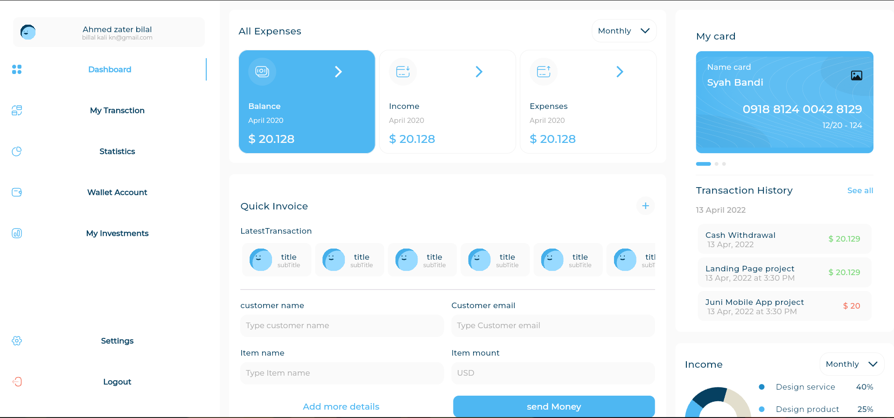
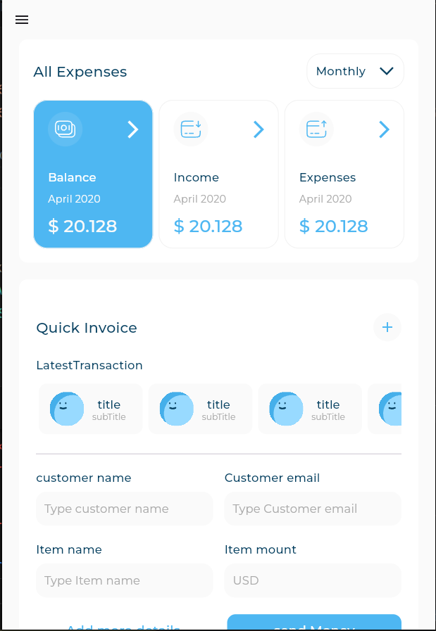
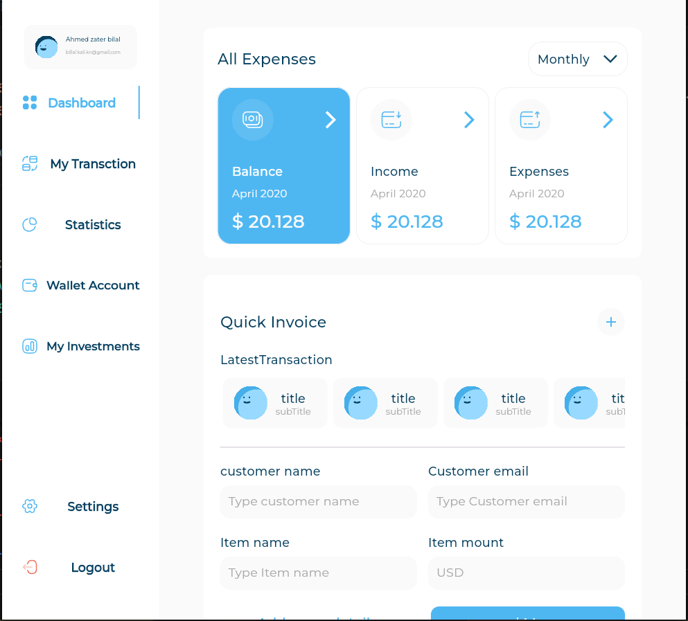

# Responsive Dashboard

**Responsive Dashboard** is a Flutter-based application showcasing a responsive user interface designed to adapt seamlessly to desktop, tablet, and mobile platforms. The project emphasizes clean design, user-friendly navigation, and scalability, making it ideal for real-world dashboard implementations.

## ✨ Key Features

- **Responsive Design**: Automatically adjusts to desktop, tablet, and mobile screen sizes.
- **Data Visualization**: Includes dynamic and visually appealing charts using the `fl_chart` package.
- **Modern UI Elements**: Leverages the `flutter_svg` and `font_awesome_icon_class` packages for sleek icons and components.
- **Device Preview**: Test responsiveness across multiple devices using the `device_preview` package.
- **Expandable Page Views**: Supports rich interactions for displaying content with the `expandable_page_view` package.

## 🛠️ Built With

- **Flutter**: Framework for cross-platform development.
- **Montserrat Font**: Ensures a modern and consistent typography style.
- **Dart SDK**: Version `>=3.4.4 <4.0.0` for enhanced performance and features.

## 📂 Project Structure

This project follows a modular architecture with proper asset management and utility functions to maintain scalability and organization. Key resources such as fonts and images are structured for easy access and maintainability.

<p align="center">
  
  
  
</p>

## Getting Started
### Prerequisites
- Flutter SDK installed 

### Installation
1. Clone the repository:
   ```bash
   git clone https://github.com/AbderraoufBelaiouar/responsive_dashboard.git
2. run the project
   ```bash
   flutter pub get
   flutter run

